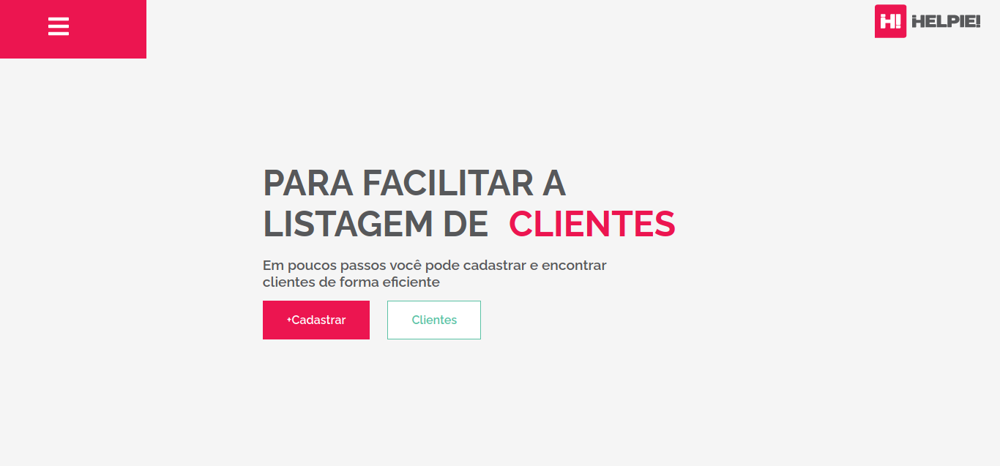

<h1 align="center">
    Helpie - Reactjs - Challenge
</h1>

 <a href="#about">About</a> • 
 <a href="#tech-stack">Tech Stack</a> •  
 <a href="#author">Author</a> • 

## About

This web app was created as part of the test to apply to be a Front-end Developer at Helpie.
It consists on an app that has two parts. The first is a mult-step form to register clients and the second is a section were the data submited from the form will be displayed.

<a href="https://allangpio.github.io/helpie-react-challenge/#/" target="_blank">Live Demo</a>

## Tech Stack

<ul>
  <li>ReactJS</li>
  <li>Redux</li>    
</ul>

### Autor

---

<b>Allan Gaia Pio</b>

Made by Allan Gaia Pio 👋🏽 Get in touch!

